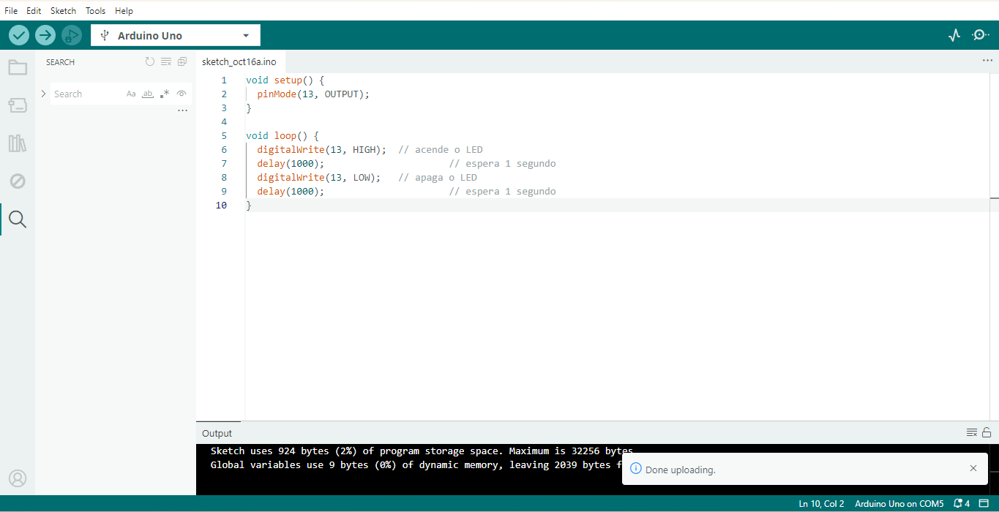
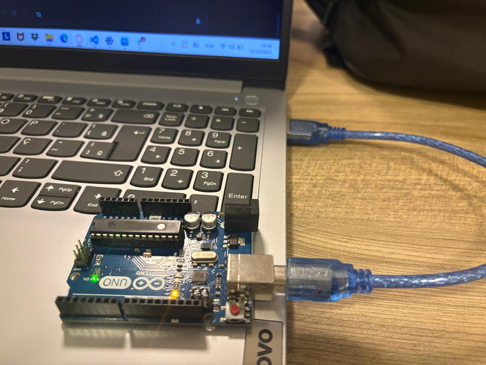
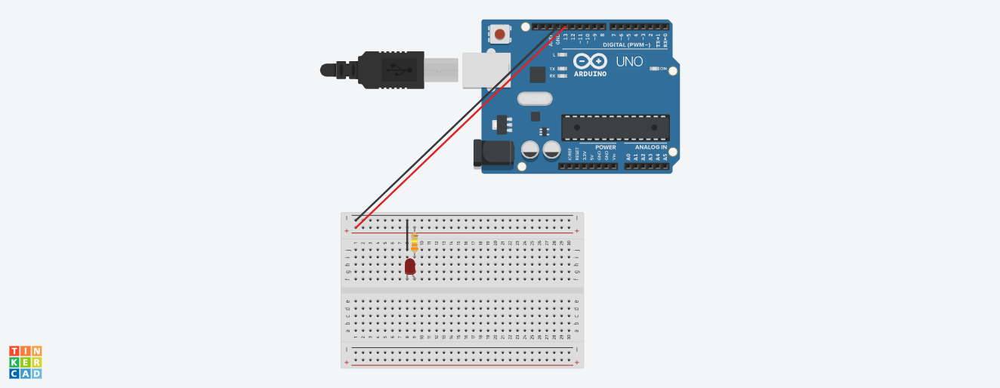
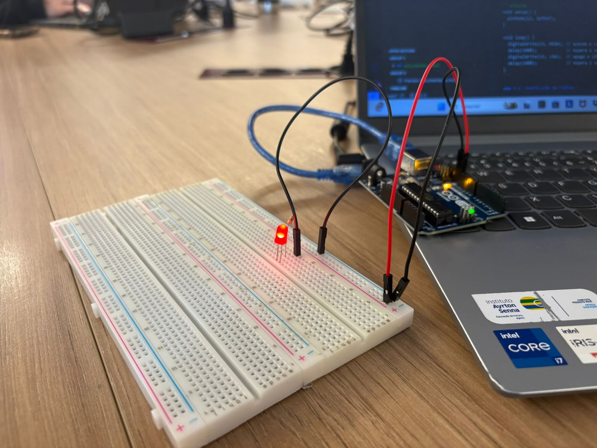

<p align="center">
  
</p>

# Projeto Piscar LED com Arduino

## Parte 1: Blink LED Interno

A primeira etapa consiste em carregar o código clássico de "blink" no Arduino para fazer o LED interno (conectado ao pino 13) piscar.

### 1.1. Código

O código utilizado para o "blink" é o seguinte:

```arduino
void setup() {
  pinMode(13, OUTPUT); // Configura o pino 13 como saída
}

void loop() {
  digitalWrite(13, HIGH); // Acende o LED
  delay(1000);            // Espera 1 segundo
  digitalWrite(13, LOW);  // Apaga o LED
  delay(1000);            // Espera 1 segundo
}
```

### 1.2. Evidências

As evidências de que o código foi carregado com sucesso e está em funcionamento na placa real são apresentadas abaixo.

**Print da Arduino IDE:**
A imagem abaixo demonstra o código aberto na IDE e o console de saída, comprovando o sucesso do carregamento do programa na placa.

<p align="center">
  
</p>

**Fotografia do Arduino em Funcionamento:**
A foto comprova o funcionamento físico do código, mostrando o Arduino conectado ao computador e o **LED Interno** (marcado com "L") aceso.

<p align="center">
  
</p>

## Parte 2: Simulando Blink LED Externo

A segunda etapa é a simulação do circuito "blink" com um LED externo e protoboard no ambiente Tinkercad.

### 2.1. Componentes Necessários

Para realizar a simulação, foram usados os seguintes componentes:

*   1 x Placa **Arduino Uno** (ou compatível)
*   1 x **Protoboard** (Placa de Ensaio)
*   1 x **LED** (de qualquer cor)
*   1 x **Resistor** de 330 Ohms (para proteger o LED)
*   3 x **Fios Jumper**

### 2.2. Diagrama de Fiação e Simulação

A simulação a seguir, gerada no **Tinkercad**, ilustra a conexão correta dos componentes:

<p align="center">
  
</p>

**Link para o Projeto no Tinkercad:**
O projeto pode ser acessado e testado diretamente no simulador através do link:
[tinkercad](https://www.tinkercad.com/things/bGOlHtFj8QB/editel?sharecode=-moSAV1EdkgZlDzH5ZwScc88hHLz0ymFuYuGFHz_R3s)

### 2.3. Código da Simulação

O código utilizado na simulação é o mesmo da Parte 1, pois o LED externo foi conectado ao pino 13:

```arduino
void setup() {
  pinMode(13, OUTPUT); // Configura o pino 13 como saída
}

void loop() {
  digitalWrite(13, HIGH); // acende o LED
  delay(1000);            // espera 1 segundo
  digitalWrite(13, LOW);  // apaga o LED
  delay(1000);            // espera 1 segundo
}
```

### 2.4. Montagem Física (Original)

A imagem abaixo mostra a montagem física do circuito na protoboard, que corresponde à simulação da Parte 2:

<p align="center">
  
</p>

## 3. Demonstração do Funcionamento

O vídeo a seguir demonstra o LED externo piscando após o código ser carregado na placa Arduino:

[Vídeo do funcionamento](https://drive.google.com/file/d/1iE7mF9LxcKLKZka8bSFb2T7IoDSAXuyC/view?usp=sharing)
