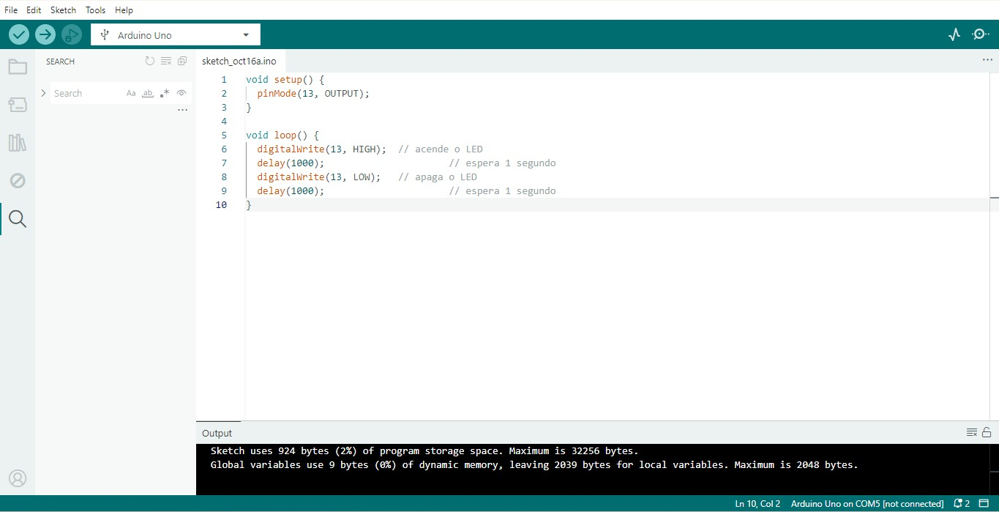

<p align="center">
  
</p>

# Projeto Piscar LED com Arduino

## 1. Componentes Necessários

Para realizar o projeto, foram usados os seguintes componentes:

*   1 x Placa **Arduino Uno** (ou compatível)
*   1 x **Protoboard** (Placa de Ensaio)
*   1 x **LED** (de qualquer cor)
*   1 x **Resistor** de 330 Ohms (para proteger o LED)
*   3 x **Fios Jumper**
*   1 x **Cabo USB**

## 2. Montagem do Circuito

O circuito é simples e segue o princípio básico de ligar um LED com um resistor limitador de corrente.

### 2.1. Diagrama de Fiação

O diagrama a seguir, gerado no **Tinkercad**, ilustra a conexão correta dos componentes:

<p align="center">
  
</p>

**Detalhes da Conexão:**

1.  Conecção do **ânodo** (perna mais longa) do LED a uma trilha da protoboard.
2.  Conecção de um terminal do **resistor** de 330 Ohms à mesma trilha do ânodo do LED.
3.  Conecção do outro terminal do resistor ao **pino digital 13** do Arduino Uno (usando um fio jumper, geralmente vermelho para sinal).
4.  Conecção do **cátodo** (perna mais curta) do LED a outra trilha da protoboard.
5.  Conecção do cátodo do LED ao pino **GND** (Terra) do Arduino Uno (usando um fio jumper, geralmente preto).

### 2.2. Montagem Física (Protoboard)

A imagem abaixo mostra a montagem física do circuito na protoboard, conectada ao Arduino Uno:

<p align="center">
  
</p>

## 3. O Código

O programa é responsável por controlar o LED, fazendo-o piscar em intervalos regulares. O código foi extraído da imagem fornecida:

<p align="center">
  
</p>

```arduino
void setup() {
  pinMode(13, OUTPUT);
}

void loop() {
  digitalWrite(13, HIGH); // acende o LED
  delay(1000);            // espera 1 segundo
  digitalWrite(13, LOW);  // apaga o LED
  delay(1000);            // espera 1 segundo
}
```

### 3.1. Explicação do Código

| Função | Descrição |
| :--- | :--- |
| `void setup()` | Executada uma única vez quando o Arduino é ligado ou reiniciado. |
| `pinMode(13, OUTPUT);` | Configura o pino digital 13 como **saída** (`OUTPUT`), permitindo que o Arduino envie energia para o LED. |
| `void loop()` | Executada repetidamente (em loop) enquanto o Arduino estiver ligado. |
| `digitalWrite(13, HIGH);` | Define o estado do pino 13 como **ALTO** (`HIGH`), fornecendo 5V e acendendo o LED. |
| `delay(1000);` | Pausa a execução do programa por **1000 milissegundos** (1 segundo). |
| `digitalWrite(13, LOW);` | Define o estado do pino 13 como **BAIXO** (`LOW`), fornecendo 0V e apagando o LED. |

## 4. Demonstração do Funcionamento

O vídeo a seguir demonstra o LED piscando após o código ser carregado na placa Arduino:

[Vídeo do funcionamento](https://drive.google.com/file/d/1iE7mF9LxcKLKZka8bSFb2T7IoDSAXuyC/view?usp=sharing)
